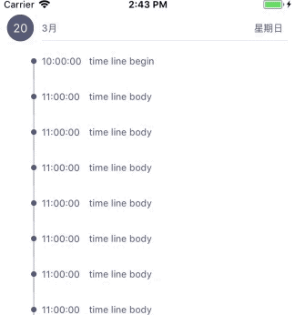

# WLScheduleTableCell

[]
[]
[]

This component for custom UITableViewCell.

## Features

- [x] event of Time Axi for UITableView

## Requirements

- iOS 8.0 or later
- Xcode 9.0 or later

## Getting Started

- Read this Readme doc

## Communication

- If you **need help**, use [luowanglin mail](luowanglin@icloud.com).
- If you'd like to **ask a general question**, use [luowanglin](luowanglin@icloud.com).
- If you **found a bug**, open an issue.
- If you **have a feature request**, open an issue.
- If you **want to contribute**, submit a pull request.
- If you **want to about me**,click to [my page](https://luowanglin.github.io)

## How To Use

- For details about how to use the library and clear examples

## Installation

- By cloning the project into your repository , The libray at WLScheduleTableCell floder

## Author
- [Wanglin Luo](https://luowanglin.github.io)

## Licenses

All source code is licensed under the [MIT License](https://raw.github.com/luowanglin/WLTimeFrame/LICENSE).

